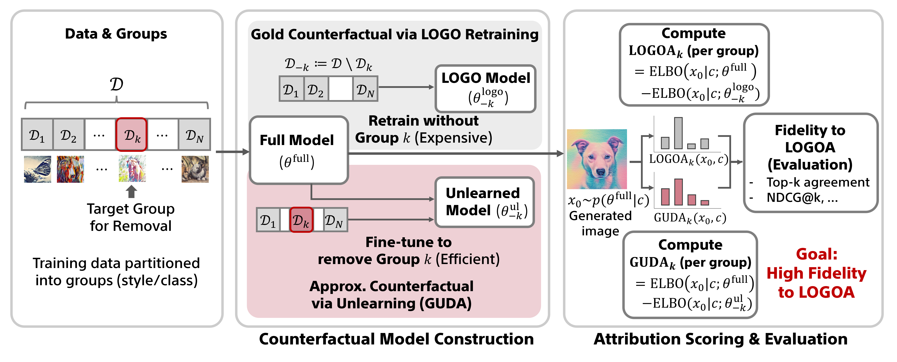

# GUDA: Counterfactual Group-wise Training Data Attribution for Diffusion Models via Unlearning



[arXiv](https://arxiv.org/abs/2601.22651) | Accepted at ICML 2026

This repository contains the public reproduction code for the GUDA experiments.

GUDA (Group Unlearning-based Data Attribution) approximates
Leave-One-Group-Out counterfactual models for diffusion models by unlearning
each group from a shared full-data model. This repository covers the CIFAR-10
class attribution and UnlearnCanvas style attribution experiments from the
paper.

For end-to-end reproduction, including artifact dependencies and validation
checks, start with [`REPRODUCTION.md`](REPRODUCTION.md).

## Paper

- **Title:** GUDA: Counterfactual Group-wise Training Data Attribution for
  Diffusion Models via Unlearning
- **Authors:** **Naoki Murata**<sup>1</sup>, Chieh-Hsin Lai<sup>1</sup>,
  Yuhta Takida<sup>1</sup>, Toshimitsu Uesaka<sup>1</sup>,
  Bac Nguyen<sup>1</sup>, Stefano Ermon<sup>2</sup>,
  Yuki Mitsufuji<sup>1,3</sup>
- **Affiliations:** <sup>1</sup> Sony AI, <sup>2</sup> Stanford University,
  <sup>3</sup> Sony Group Corporation
- **Contact:** <code>naoki.murata@sony.com</code>
- **Venue:** ICML 2026
- **Preprint:** https://arxiv.org/abs/2601.22651

## Repository Layout

```text
CIFAR10/          CIFAR-10 DDPM training, LOGO, GUDA-U, and ranking evaluation
UnlearnCanvas/    SD 1.5 fine-tuning, LOGO, GUDA-C, and style attribution
env/              Minimal Python dependency lists
docs/examples/    Runnable command examples
REPRODUCTION.md   End-to-end reproduction guide and artifact dependency map
```

Datasets, checkpoints, generated images, and precomputed caches are not
distributed. The code expects users to provide or produce those artifacts under
local `data/`, `checkpoints/`, `outputs/`, and `results/` directories.

## Release Scope

This repository is intended to contain only source code written for the GUDA
experiments and prompt metadata used for the UnlearnCanvas evaluation. It does
not include third-party source code, model weights, checkpoints, generated
images, precomputed caches, or image datasets.

External models and datasets referenced by the commands, including Stable
Diffusion 1.5, CIFAR-10, and UnlearnCanvas images, must be obtained separately
by users under their respective licenses, terms, and access policies. The
distributed UnlearnCanvas files are prompt and descriptor metadata only.

## Environment

Use separate environments for the CIFAR-10 and UnlearnCanvas pipelines. Install
PyTorch first with the CUDA wheel appropriate for your system, then install the
pipeline requirements:

```bash
python3 -m venv .venv-cifar10
source .venv-cifar10/bin/activate
python3 -m pip install --upgrade pip
# Install CUDA-enabled torch/torchvision for your system first.
python3 -m pip install -r env/cifar10.requirements.txt

python3 -m venv .venv-uc
source .venv-uc/bin/activate
python3 -m pip install --upgrade pip
# Install CUDA-enabled torch/torchvision for your system first.
python3 -m pip install -r env/unlearncanvas.requirements.txt
```

GPU reproduction requires a CUDA-enabled PyTorch build, not the CPU-only wheel.
See [`env/README.md`](env/README.md) for known-working reference environments
and more detailed setup notes.

## CIFAR-10 Reproduction Order

Run from `CIFAR10/` with `PYTHONPATH=.`.

1. Train the full unconditional CIFAR-10 model.
2. Train the LOGO models, one model per held-out class. This is expensive and
   is expected to be run by the user.
3. Train GUDA-U unlearned models with ReTrack for classes 0-9.
4. Optionally train GUDA-U variants with ESD for the ReTrack-vs-ESD comparison.
5. Generate query images and compute LOGOA / GUDA attribution scores.
6. Compare LOGOA and GUDA rankings with the ranking metrics.
7. Run ReTrack ablations over unlearning epochs, learning rate,
   forget/preserve weighting, and nearest-neighbor count.

See `docs/examples/cifar10_commands.md` and the batch examples under
`CIFAR10/scripts/run_*.sh`. See `REPRODUCTION.md` for the full artifact graph.

## UnlearnCanvas Reproduction Order

Run from `UnlearnCanvas/` with `PYTHONPATH=.`.

1. Prepare the UnlearnCanvas images locally. Prompt metadata used by the paper
   is included under `UnlearnCanvas/data/`.
2. Fine-tune SD 1.5 on the 16 target styles.
3. Train 16 LOGO models, one model per target style. This is expensive and is
   expected to be run by the user.
4. Train GUDA-C with the AWSS anchor strategy.
5. Generate the 320 query images and compute LOGOA / GUDA attribution scores.
6. Compare LOGOA and GUDA rankings.
7. Run anchor strategy ablations: AWSS, uniform sampling, and style removed.

See `docs/examples/unlearncanvas_commands.md` and the batch examples under
`UnlearnCanvas/scripts/run_*.sh`. See `REPRODUCTION.md` for the full artifact
graph and the 16 paper-faithful target styles.

## Maintenance

This repository is maintained for reproduction support.

## Citation

The final ICML citation will be updated when available. For now, please cite
the arXiv version:

```bibtex
@misc{murata2026guda,
  title        = {{GUDA}: Counterfactual Group-wise Training Data Attribution for Diffusion Models via Unlearning},
  author       = {Murata, Naoki and Takida, Yuhta and Lai, Chieh-Hsin and Uesaka, Toshimitsu and Nguyen, Bac and Ermon, Stefano and Mitsufuji, Yuki},
  year         = {2026},
  eprint       = {2601.22651},
  archivePrefix = {arXiv},
  primaryClass = {cs.LG},
  url          = {https://arxiv.org/abs/2601.22651}
}
```

## License

This project is licensed under the MIT License. See [LICENSE](LICENSE) for details.
